# Traffic Sign Classification & Adversarial Attacks

This project demonstrates the complete development of a **Convolutional Neural Network (CNN)** for traffic sign recognition and explores the critical field of **AI Security** through Black-Box and White-Box adversarial attacks.

The implementation is divided into multiple phases, moving from standard model training to security auditing, highlighting how high-accuracy models can be deceptively fragile when faced with physical or mathematical perturbations.

---

# Installations

Main required packages for training, inference, and security testing:

```bash
pip install matplotlib
pip install opencv-contrib-python
pip install tensorflow keras
pip install pandas
pip install scikit-learn
```

---

# Repository Structure

- **codes/** Contains all Python implementation files: `train.py` (model training), `predict.py` (live inference), and `attack_fgsm.py` (white-box attack generation).

- **files/** Contains required input and weights files: `labels.csv` (mapping class IDs to names), `model_trained.h5` (the saved model), and `30img.png` (input for attack generation).

- **images/** Contains screenshots and output visualizations used in this documentation to demonstrate model performance and successful adversarial attacks.

- **README.md** Project documentation file containing installation steps, implementation details, and security analysis.

---

# Development Phases

### 1️⃣ Model Training (CNN Architecture)
**Script:** `codes/train.py` | **Dataset:** `myData/` (Folders 0-42)

The foundation of the project is a deep learning model trained on the GTSRB dataset to recognize 43 different traffic signs.

* **Preprocessing:** Images are grayscaled and Histogram Equalized to standardize lighting conditions before being normalized (scaled between 0 and 1).
* **Architecture:** A multi-layer CNN featuring Convolutional layers for feature extraction, Max Pooling for spatial reduction, and Dropout layers to prevent overfitting.
* **Optimization:** The model is compiled using the **Adam** optimizer and **Categorical Crossentropy** loss, training for 30 epochs.

> **Output Demonstration:**
> 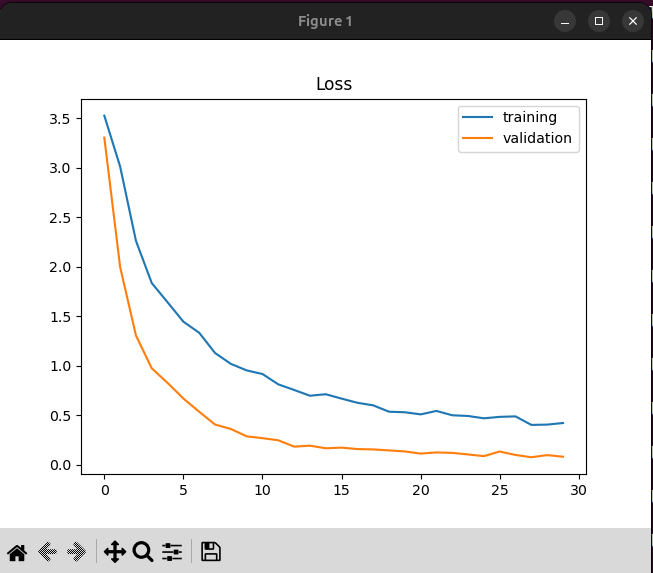

---

### 2️⃣ Live Inference & Baseline Prediction
**Script:** `codes/predict.py` | **Input:** Live Webcam / Sample Image

This stage establishes the "Eyes" of the system, using the webcam to detect signs in real-time and provide class labels and confidence scores.

* **Real-time Processing:** Captures frames, applies preprocessing, and reshapes data to `(1, 32, 32, 1)` for model compatibility.
* **Baseline Result:** A clear image of a **30 km/h** sign is correctly detected with high confidence (approx. 99%).

> **Output Demonstration:**
> 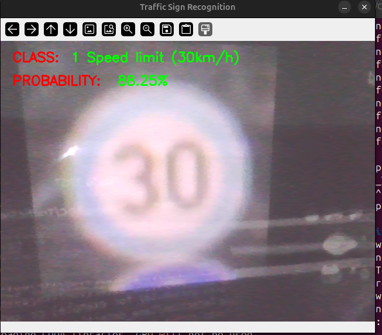

---

### 3️⃣ Black-Box Attack (Physical Interference)
**Input:** Manually altered 30 km/h sign images.

This phase simulates real-world environmental "attacks" like vandalism or extreme lighting. It demonstrates that CNNs prioritize local pixel patterns over global context. A **shadow that is too dark** or a simple piece of tape can easily throw off a prediction.

* **Case A (Center of '3'):** A small dash in the middle of the '3' dropped accuracy to **85%**.
* **Case B (Red Border):** A black line breaking the red outer circle caused the model to fail, misidentifying it as **20 km/h**.
* **Case C (Top of '3'):** A mark where the number meets the white background also flipped the prediction to **20 km/h**.

> **Attack Results:**

### Case 0: Normal Image (No Tampering)
*Baseline test to confirm the model recognizes the clear sign.*
* **Input:** 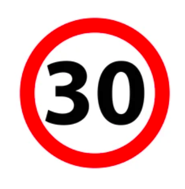
* **Prediction:** 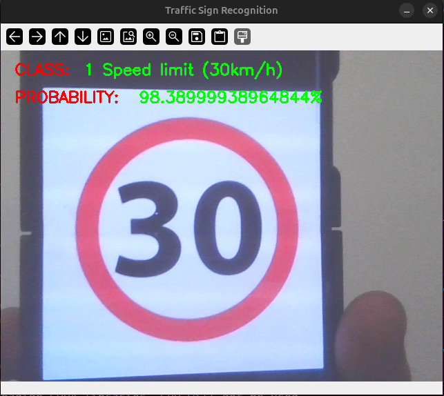

---

### Case 1: The Center of the '3'
*Testing the impact of minor internal feature obstruction.*
* **Input:** 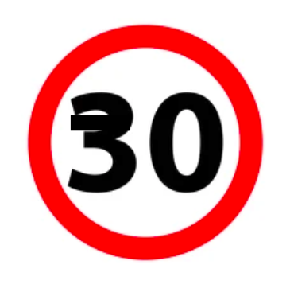
* **Prediction:** 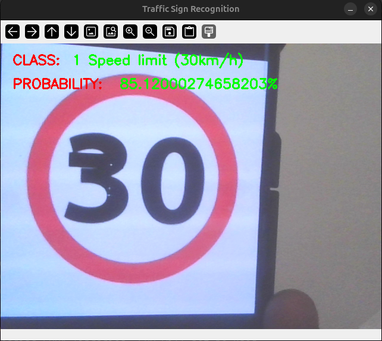

---

### Case 2: The Red Border
*Testing the model's reliance on the outer circular geometry.*
* **Input:** 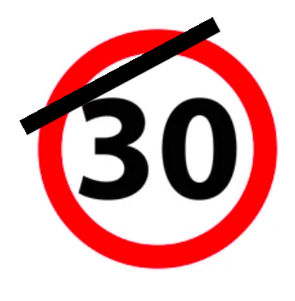
* **Prediction:** 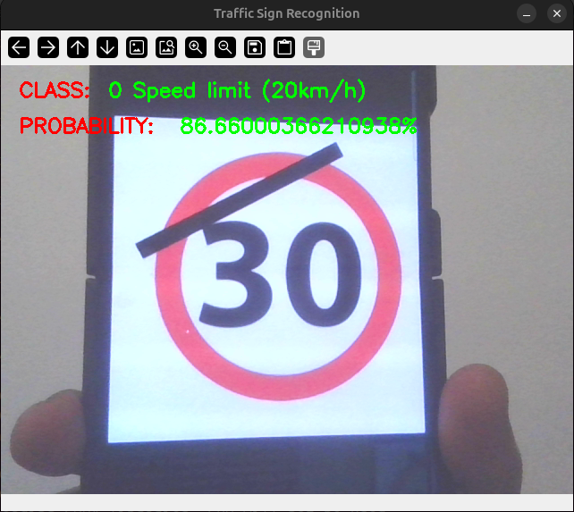

---

### Case 3: The Top "Vulnerability" Spot
*Testing the critical junction where the digit meets the background.*
* **Input:** 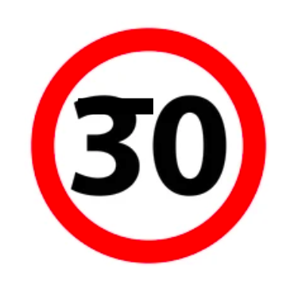
* **Prediction:** 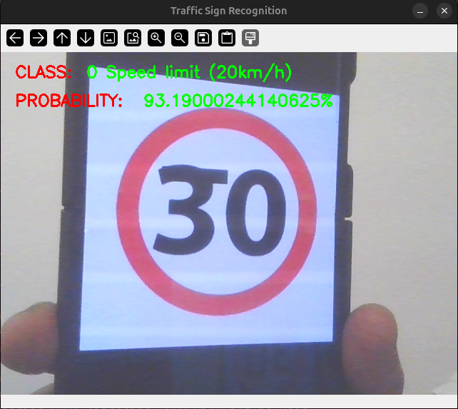

---

### 4️⃣ White-Box Attack (FGSM)
**Script:** `codes/attack_fgsm.py` | **Input:** `model_trained.h5`

The final phase uses the **Fast Gradient Sign Method (FGSM)**. This is a mathematical attack where we use the model's own gradients to create "invisible" noise.

* **Gradient Calculation:** The script looks inside the model to see which pixels, if changed, will most increase the "loss" (confusion).
* **Epsilon (ε):** A small multiplier (e.g., 0.04) ensures the noise is faint enough for the human eye to ignore, but strong enough to flip the AI's logic.
* **The Result:** * **Original Image:** Predicted as **30 km/h** (84% accuracy).
    * **Spoofed Image:** Predicted as **120 km/h** (81% accuracy).
* **Safety Implication:** Even if the model corrects itself a second later, in an autonomous vehicle, a **split-moment misclassification** could trigger dangerous acceleration before the system realizes the error.

> **FGSM Results:**

#### Step A: The Baseline (Clean Input)
*The starting point: a 30 km/h image the model knows perfectly.*
* **Input Image:** 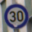
* **Prediction:** 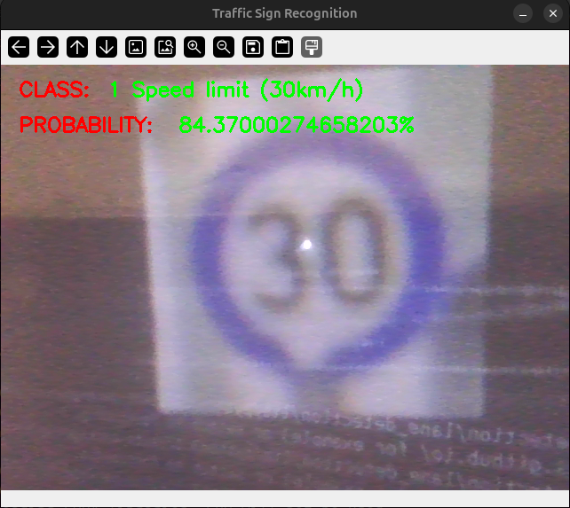

#### Step B: The Attack (Adversarial Spoof)
*The mathematical "noise" is added. Notice the prediction flips to a much higher speed.*
* **Generated Spoof:** 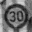
* **Prediction:** 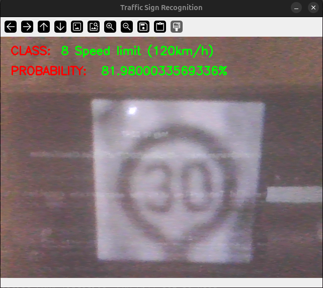

---

# Summary of Pipeline Logic

1.  **Capture/Load:** Capture raw frames or load static images.
2.  **Pre-process:** Grayscale, Equalize, and Normalize.
3.  **Classify:** Run the CNN model to get class ID and probability.
4.  **Audit:** Perform Black-Box/White-Box attacks to test robustness.
5.  **Analyze:** Evaluate the gap between human perception and AI logic.

---

# Technologies Used

- Python
- TensorFlow / Keras
- OpenCV
- NumPy & Pandas
- Scikit-Learn
- Matplotlib

---

# Applications & Security Insights

-   **Autonomous Vehicle Safety:** Highlights why systems cannot rely solely on vision and require multi-sensor fusion (LiDAR/Radar).
-   **Adversarial Robustness:** Serves as a baseline for implementing "Adversarial Training" to harden models against attacks.
-   **AI Auditing:** Demonstrates how to test for edge cases where lighting and shadows might cause fatal system failures.

